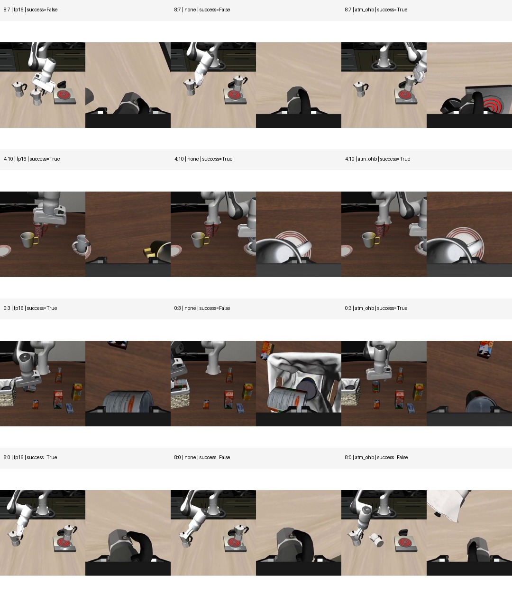

# ICRA Video Asset Manifest

这份清单记录 2026-07-02 在 5090 上对 rollout 视频的只读搜索结果。它补充 [`docs/icra_video_keyframe_supplement_plan_zh.md`](icra_video_keyframe_supplement_plan_zh.md)，用于区分哪些素材已经能直接用，哪些需要后续重渲染。

## 5090 搜索结论

- 5090 当前工作区：`/root/autodl-tmp/quantvla-reproduction-current`
- 归档目录：`/root/autodl-tmp/quantvla-archive-20260629-1945`
- 已找到大量 compile/tactic rollout videos，主要在 `rollouts/2026_06_29` 到 `rollouts/2026_07_01`。
- phase5 quantization ablation 的 prepare JSON 仍在归档中，但对应 `none / atm / ohb` 三个 init0-14 大规模 run 的原始 mp4 没有完整留存。
- 量化线 Q1-Q4 当前最可靠素材仍是已有 contact sheets；若投稿视频必须展示完整量化 rollout，需要小规模重跑 Q1-Q4。

## 已拉回本机的 compile/tactic 视频

这些文件已经从 5090 下载并复制到当前仓库：

```text
docs/icra_video_assets/raw_videos/compile_tactic/
```

轻量 contact sheet 也已加入仓库：


## C1: task4:init6

| mode | outcome | remote mp4 |
| --- | --- | --- |
| FP16 baseline | S245 | `/root/autodl-tmp/quantvla-reproduction-current/rollouts/2026_06_29/2026_06_29-22_15_39--episode=7--success=True--task=put_the_white_mug_on_the_left_plate_and_put_the_ye.mp4` |
| speed-only compile | F991 | `/root/autodl-tmp/quantvla-reproduction-current/rollouts/2026_06_29/2026_06_29-23_24_45--episode=7--success=False--task=put_the_white_mug_on_the_left_plate_and_put_the_ye.mp4` |
| window_0_120 | S241 | `/root/autodl-tmp/quantvla-reproduction-current/rollouts/2026_06_30/2026_06_30-15_50_36--episode=7--success=True--task=put_the_white_mug_on_the_left_plate_and_put_the_ye.mp4` |

Interpretation: speed-only compile pushes this case into a horizon failure, while the duration-protected tactic recovers a branch visually close to FP16.

## C2: task6:init0

| mode | outcome | remote mp4 |
| --- | --- | --- |
| FP16 baseline | S210 | `/root/autodl-tmp/quantvla-reproduction-current/rollouts/2026_06_29/2026_06_29-22_15_39--episode=12--success=True--task=put_the_white_mug_on_the_plate_and_put_the_chocola.mp4` |
| speed-only compile | F991 | `/root/autodl-tmp/quantvla-reproduction-current/rollouts/2026_06_29/2026_06_29-23_24_45--episode=12--success=False--task=put_the_white_mug_on_the_plate_and_put_the_chocola.mp4` |
| window_0_120 | S205 | `/root/autodl-tmp/quantvla-reproduction-current/rollouts/2026_06_30/2026_06_30-15_50_36--episode=12--success=True--task=put_the_white_mug_on_the_plate_and_put_the_chocola.mp4` |

Interpretation: speed-only compile stalls in the wrong branch, while `window_0_120` restores a fast success. This is the cleanest video case for duration sensitivity.

## Quantization Video Status

### 2026-07-02/03 Controlled Rerun

已经在 5090 上补跑 Q1-Q4 的最小视频矩阵：

```text
run id: icra_quant_video_matrix_20260702_233443
cases: 8:7, 4:10, 0:3, 8:0
modes: fp16, none, atm_ohb
remote bundle: /tmp/icra_quant_video_matrix_20260702_233443_bundle
local bundle: /private/tmp/quantvla_video_candidates/icra_quant_video_matrix_20260702_233443_bundle
repo videos: docs/icra_video_assets/raw_videos/quant_matrix/
```

原始 mp4 已复制到当前仓库；trace 仍保留在本机临时 bundle 中。仓库中保存 raw videos、轻量 contact sheet 和 manifest：



- Raw videos: [`docs/icra_video_assets/raw_videos/quant_matrix/`](icra_video_assets/raw_videos/quant_matrix/)
- Contact sheet: [`docs/icra_video_assets/q1q4_quant_matrix_contact_sheet.jpg`](icra_video_assets/q1q4_quant_matrix_contact_sheet.jpg)
- Manifest: [`docs/icra_video_assets/q1q4_quant_matrix_manifest.tsv`](icra_video_assets/q1q4_quant_matrix_manifest.tsv)

本次 rerun 的 outcome 矩阵如下：

| case | FP16 | W4A8 none | W4A8 ATM+OHB | note |
| --- | --- | --- | --- | --- |
| `task8:init7` | F991 | F991 | S382 | ATM+OHB repairs this rerun; differs from the older Phase5 contact-sheet story. |
| `task4:init10` | S251 | S248 | S259 | all modes succeed in this rerun; differs from the older Phase5 contact-sheet story. |
| `task0:init3` | S782 | F991 | S349 | direct raw-video support for none regression and ATM+OHB recovery. |
| `task8:init0` | S749 | F991 | F991 | direct raw-video support for quantization regression that ATM+OHB does not fix. |

解释口径：

- 这批视频是同 task/init 的 controlled rerun，适合做 raw-motion supplement asset。
- 它不是原 Phase5 contact sheet 的逐位复刻；Q1/Q2 的 outcome 已发生变化，不能直接替换旧图里的定性叙事。
- Q3/Q4 与既有 regression 故事一致，可以直接作为 full-motion 视频候选。
- Q1 可以改写成 “ATM+OHB repair under rerun”，仍然支持闭环 basin redistribution；但不要再说它复刻旧 Q1 的 `none` repair。
- Q2 在本次 rerun 中没有 outcome flip，更适合作为稳定成功参考或暂时不用作主视频病例。

### Original Phase5 Assets

原 Phase5 主推荐量化病例仍然保留在关键帧层面：

| case | current asset | raw mp4 status |
| --- | --- | --- |
| Q1 `task8:init7` | [`analysis_keyframes/batch2/none_repair_task8_init7.jpg`](../analysis_keyframes/batch2/none_repair_task8_init7.jpg) | original phase5 ablation mp4 not found; controlled rerun mp4 available but outcome differs |
| Q2 `task4:init10` | [`analysis_keyframes/batch2/atmohb_repair_task4_init10.jpg`](../analysis_keyframes/batch2/atmohb_repair_task4_init10.jpg) | original phase5 ablation mp4 not found; controlled rerun mp4 available but outcome differs |
| Q3 `task0:init3` | [`analysis_keyframes/regressions/none_regress_task0_init3.jpg`](../analysis_keyframes/regressions/none_regress_task0_init3.jpg) | controlled rerun mp4 available and outcome matches the regression story |
| Q4 `task8:init0` | [`analysis_keyframes/regressions/both_quant_regress_task8_init0.jpg`](../analysis_keyframes/regressions/both_quant_regress_task8_init0.jpg) | controlled rerun mp4 available and outcome matches the regression story |

`trace_cases/quantvla_trace_cases_trace_20260606_135425` contains later trace reruns for several of these cases, but some outcomes differ from the phase5 contact sheets. Therefore those trace videos should not be used as replacements for the phase5 qualitative story without clearly labeling them as reruns.

## Recommendation

For the ICRA supplement:

1. Use Q3/Q4 controlled-rerun videos as the safest full-motion quantization clips.
2. Use Q1 controlled-rerun video if the caption is updated to describe ATM+OHB repair in the rerun.
3. Keep original Q1/Q2 contact sheets if the text needs the older Phase5 outcome story.
4. Use C1-C2 videos for the compile/tactic story, because the raw mp4s are available and already mapped.
