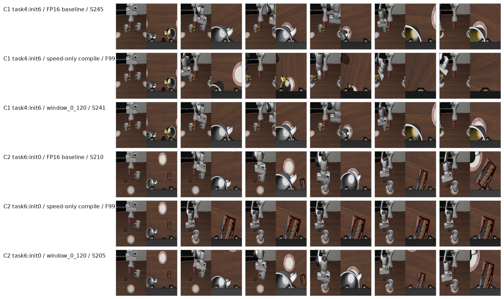

# ICRA Video Asset Manifest

这份清单记录 2026-07-02 在 5090 上对 rollout 视频的只读搜索结果。它补充 [`docs/icra_video_keyframe_supplement_plan_zh.md`](icra_video_keyframe_supplement_plan_zh.md)，用于区分哪些素材已经能直接用，哪些需要后续重渲染。

## 5090 搜索结论

- 5090 当前工作区：`/root/autodl-tmp/quantvla-reproduction-current`
- 归档目录：`/root/autodl-tmp/quantvla-archive-20260629-1945`
- 已找到大量 compile/tactic rollout videos，主要在 `rollouts/2026_06_29` 到 `rollouts/2026_07_01`。
- phase5 quantization ablation 的 prepare JSON 仍在归档中，但对应 `none / atm / ohb` 三个 init0-14 大规模 run 的原始 mp4 没有完整留存。
- 量化线 Q1-Q4 当前最可靠素材仍是已有 contact sheets；若投稿视频必须展示完整量化 rollout，需要小规模重跑 Q1-Q4。

## 已拉回本机的 compile/tactic 视频

这些文件已经从 5090 下载到本机临时目录：

```text
/private/tmp/quantvla_video_candidates/raw/
```

它们没有加入 git，避免仓库膨胀。轻量 contact sheet 已加入仓库：



## C1: task4:init6

| mode | outcome | remote mp4 |
| --- | --- | --- |
| FP16 baseline | S245 | `/root/autodl-tmp/quantvla-reproduction-current/rollouts/2026_06_29/2026_06_29-22_15_39--episode=7--success=True--task=put_the_white_mug_on_the_left_plate_and_put_the_ye.mp4` |
| speed-only compile | F991 | `/root/autodl-tmp/quantvla-reproduction-current/rollouts/2026_06_29/2026_06_29-23_24_45--episode=7--success=False--task=put_the_white_mug_on_the_left_plate_and_put_the_ye.mp4` |
| window_0_120 | S241 | `/root/autodl-tmp/quantvla-reproduction-current/rollouts/2026_06_30/2026_06_30-15_50_36--episode=7--success=True--task=put_the_white_mug_on_the_left_plate_and_put_the_ye.mp4` |

Interpretation: speed-only compile pushes this case into a horizon failure, while the duration-protected tactic recovers a branch visually close to FP16.

## C2: task6:init0

| mode | outcome | remote mp4 |
| --- | --- | --- |
| FP16 baseline | S210 | `/root/autodl-tmp/quantvla-reproduction-current/rollouts/2026_06_29/2026_06_29-22_15_39--episode=12--success=True--task=put_the_white_mug_on_the_plate_and_put_the_chocola.mp4` |
| speed-only compile | F991 | `/root/autodl-tmp/quantvla-reproduction-current/rollouts/2026_06_29/2026_06_29-23_24_45--episode=12--success=False--task=put_the_white_mug_on_the_plate_and_put_the_chocola.mp4` |
| window_0_120 | S205 | `/root/autodl-tmp/quantvla-reproduction-current/rollouts/2026_06_30/2026_06_30-15_50_36--episode=12--success=True--task=put_the_white_mug_on_the_plate_and_put_the_chocola.mp4` |

Interpretation: speed-only compile stalls in the wrong branch, while `window_0_120` restores a fast success. This is the cleanest video case for duration sensitivity.

## Quantization Video Status

主推荐量化病例仍然保留在关键帧层面：

| case | current asset | raw mp4 status |
| --- | --- | --- |
| Q1 `task8:init7` | [`analysis_keyframes/batch2/none_repair_task8_init7.jpg`](../analysis_keyframes/batch2/none_repair_task8_init7.jpg) | original phase5 ablation mp4 not found |
| Q2 `task4:init10` | [`analysis_keyframes/batch2/atmohb_repair_task4_init10.jpg`](../analysis_keyframes/batch2/atmohb_repair_task4_init10.jpg) | original phase5 ablation mp4 not found |
| Q3 `task0:init3` | [`analysis_keyframes/regressions/none_regress_task0_init3.jpg`](../analysis_keyframes/regressions/none_regress_task0_init3.jpg) | original phase5 ablation mp4 not found |
| Q4 `task8:init0` | [`analysis_keyframes/regressions/both_quant_regress_task8_init0.jpg`](../analysis_keyframes/regressions/both_quant_regress_task8_init0.jpg) | original phase5 ablation mp4 not found |

`trace_cases/quantvla_trace_cases_trace_20260606_135425` contains later trace reruns for several of these cases, but some outcomes differ from the phase5 contact sheets. Therefore those trace videos should not be used as replacements for the phase5 qualitative story without clearly labeling them as reruns.

## Recommendation

For the ICRA supplement:

1. Use Q1-Q4 contact sheets for the quantization story.
2. Use C1-C2 videos for the compile/tactic story, because the raw mp4s are available and already mapped.
3. Do not rerun quantization unless the final submission specifically needs full motion video for Q1-Q4.
4. If rerunning, only rerun the 4 quant cases and the 3 modes needed for the story; no full benchmark is needed.
