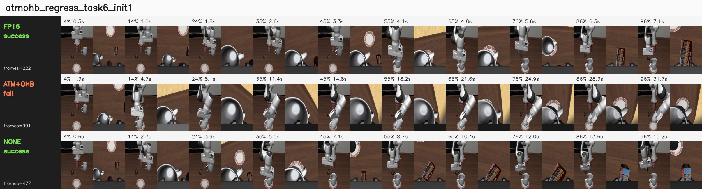

# Paper v2 Keyframe Diagnostics

Purpose: add a paper-ready qualitative layer to the paired rollout flip analysis. This note uses existing contact sheets only. It does not introduce new inference runs.

## Source Contact Sheets

Representative sheets used in the paper text:

| case | sheet |
|---|---|
| task 8 init 7, raw quant repair | `analysis_keyframes/batch2/none_repair_task8_init7.jpg` |
| task 4 init 10, ATM+OHB repair | `analysis_keyframes/batch2/atmohb_repair_task4_init10.jpg` |
| task 0 init 3, raw quant regression | `analysis_keyframes/regressions/none_regress_task0_init3.jpg` |
| task 6 init 1, ATM+OHB regression | `analysis_keyframes/regressions/atmohb_regress_task6_init1.jpg` |
| task 8 init 0, both quantized modes regress | `analysis_keyframes/regressions/both_quant_regress_task8_init0.jpg` |

Each sheet contains three matched policy rows:

```text
FP16
W4A8 llm_dit_mlp + ATM+OHB
W4A8 llm_dit_mlp + none
```

Rows are sampled uniformly over the rollout. Green labels denote success; red labels denote horizon failure. Frame counts are rendered on the sheet.

## Paper-Ready Case Table

| case | outcome pattern | keyframe-level observation | interpretation |
|---|---|---|---|
| task 8 init 7 | FP16 fail 991; ATM+OHB fail 991; none success 388 | none enters a shorter successful approach branch early; FP16 and ATM+OHB remain in repeated correction. | Raw quantization can move a weak FP16 slice out of a failure basin. |
| task 4 init 10 | FP16 fail 991; none fail 991; ATM+OHB success 242 | ATM+OHB completes the mug/plate interaction early; both other policies run to horizon. | Compensation can repair contact timing or object-interaction ordering. |
| task 0 init 3 | FP16 success 250; ATM+OHB success 267; none fail 991 | none disrupts an otherwise fast object-container relation and never recovers. | Raw quantization can regress an FP16 success, not only repair failures. |
| task 6 init 1 | FP16 success 222; none success 477; ATM+OHB fail 991 | ATM+OHB remains visually stable but under-progresses near the decisive placement phase. | Balancing can be too conservative or can shift progress timing. |
| task 8 init 0 | FP16 success 657; ATM+OHB fail 991; none fail 991 | Both quantized rows take the wrong side of a task-8 decision boundary that FP16 crosses successfully. | The same task family can contain both quantization repairs and quantization regressions. |

## Synthesis

The keyframes support the same mechanism as the paired success tables:

```text
quantization changes trajectory basin membership
```

The repaired cases are usually not tiny final-placement differences. They branch earlier and often terminate much sooner than the corresponding failed rollouts. That matters because it argues against a simple explanation where quantization merely adds late-stage placement noise.

The regressions provide the counterweight. In task 0 init 3, raw quantization damages a fast FP16 success. In task 6 init 1, ATM+OHB is not visibly unstable, but it fails to complete the decisive placement phase. In task 8 init 0, both quantized policies fail even though task 8 contains many raw-quant repairs elsewhere. This prevents the over-simple narrative that quantization is beneficial exploration or that ATM/OHB is a monotonic stabilizer.

The most defensible paper claim is therefore:

```text
paired rollout flips correspond to visible trajectory-basin changes;
they are not only aggregate success-rate bookkeeping.
```

## Visual Contact Sheets

### task 8 init 7: raw quant repair


### task 4 init 10: ATM+OHB repair


### task 0 init 3: raw quant regression


### task 6 init 1: ATM+OHB regression



### task 8 init 0: both quantized modes regress


## Limits

This is still qualitative. The contact sheets do not provide object-pose time series, end-effector distances to goal regions, contact timestamps, or success-margin measurements. They are suitable as supporting evidence for trajectory redistribution, not as a replacement for future geometric trace instrumentation.
