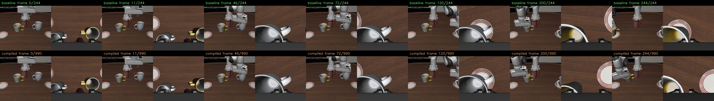
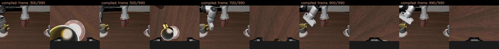
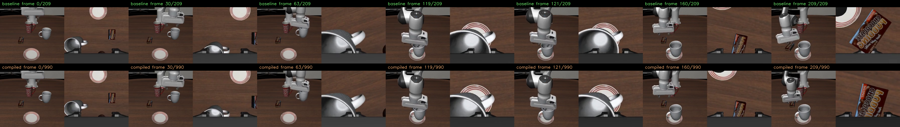
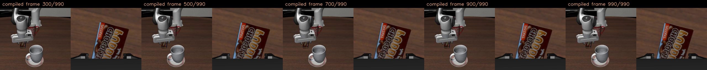

# Phase 13 torch.compile 回归病例分析

本报告分析 `torch.compile(policy.model.action_head.model)` 在 Phase 13 中的速度收益和闭环成功率回归。

核心结论：

- 速度收益稳定成立：server p50 从约 `155 ms` 降到约 `68-70 ms`。
- 行为不是透明等价：15-case 中 success 从 `7/15` 降到 `5/15`。
- 定向复验中，baseline 两次 `3/4`，compiled 在 `reduce-overhead` 和 `default` 下都是 `0/4`。
- 初始 observation 完全一致，step0 action 只有 `2e-4` 到 `9e-4` 级别 RMSE；失败来自小扰动在闭环接触动力学中的放大。

## 15-Case Matched Set

配置：

```text
tag: phase13_torch_compile_action_head_model_15case_v1
case list: 4:6,4:7,4:8,4:9,4:10,6:0,6:1,6:2,6:3,6:4,8:6,8:7,8:8,8:9,8:10
compile target: action_head_model
compile mode: reduce-overhead
compile backend: inductor
policy seed base: 20260613
```

汇总：

| policy | success | calls | client p50 | server p50 | server p90 |
|---|---:|---:|---:|---:|---:|
| FP16 baseline | 7/15 | 10068 | 160.6 ms | 155.3 ms | 162.0 ms |
| FP16 + compile | 5/15 | 11316 | 74.6 ms | 70.1 ms | 151.9 ms |

分任务：

| task | baseline | compiled |
|---|---:|---:|
| task4 | 3/5 | 2/5 |
| task6 | 3/5 | 2/5 |
| task8 | 1/5 | 1/5 |

主要翻转：

| case | baseline | compiled |
|---|---|---|
| 4:6 | success | fail |
| 6:0 | success | fail |
| 8:10 | success | fail |
| 8:9 | fail | success |

## Flip-Case 复验

为了判断失败是否偶发，复验 case：

```text
4:6,6:0,8:10,8:9
```

结果：

| run | policy | success | calls | client p50 | server p50 | server p90 |
|---|---|---:|---:|---:|---:|---:|
| reduce-overhead | baseline | 3/4 | 1869 | 160.9 ms | 156.0 ms | 161.1 ms |
| reduce-overhead | compiled | 0/4 | 3964 | 74.1 ms | 69.7 ms | 148.7 ms |
| default | baseline | 3/4 | 1869 | 160.9 ms | 155.8 ms | 160.8 ms |
| default | compiled | 0/4 | 3964 | 72.8 ms | 68.3 ms | 146.2 ms |

逐 case：

| case | reduce baseline | reduce compiled | default baseline | default compiled |
|---|---|---|---|---|
| 4:6 | success, 245 steps | fail, 991 steps | success, 245 steps | fail, 991 steps |
| 6:0 | success, 210 steps | fail, 991 steps | success, 210 steps | fail, 991 steps |
| 8:9 | success, 423 steps | fail, 991 steps | success, 423 steps | fail, 991 steps |
| 8:10 | fail, 991 steps | fail, 991 steps | fail, 991 steps | fail, 991 steps |

解读：

- `4:6` 和 `6:0` 是稳定回归样本。
- `8:9` / `8:10` 是边界波动样本。15-case 与复验中的 baseline 成败发生互换，说明 task8 这两个 init 对闭环扰动非常敏感。
- `default` mode 没有降低行为回归，且速度与 `reduce-overhead` 基本同级。

## Per-Step Trace

对比 baseline 与 compiled 的 episode trace，字段包括：

- `pre_robot0_eef_pos`
- `post_robot0_eef_pos`
- `raw_action`
- `libero_action`
- `reward`
- `done`

`step0_pre_mm` 为初始 EEF 位置差。所有 case 都是 `0`，说明初始状态一致。

`step0_raw_rmse` 为 step0 raw action 的 7 维 RMSE。

| mode | case | base/comp | steps | step0 pre diff | step0 raw RMSE | first >1 mm | first >5 mm | first >10 mm |
|---|---|---:|---:|---:|---:|---:|---:|---:|
| reduce | 4:6 | 1/0 | 245/990 | 0.000 mm | 0.000840 | step 11 | step 46 | step 72 |
| reduce | 6:0 | 1/0 | 210/990 | 0.000 mm | 0.000217 | step 63 | step 119 | step 121 |
| reduce | 8:9 | 1/0 | 423/990 | 0.000 mm | 0.000918 | step 93 | step 135 | step 141 |
| reduce | 8:10 | 0/0 | 990/990 | 0.000 mm | 0.000677 | step 122 | step 143 | step 146 |
| default | 4:6 | 1/0 | 245/990 | 0.000 mm | 0.000840 | step 11 | step 46 | step 72 |
| default | 6:0 | 1/0 | 210/990 | 0.000 mm | 0.000217 | step 63 | step 119 | step 121 |
| default | 8:9 | 1/0 | 423/990 | 0.000 mm | 0.000918 | step 93 | step 135 | step 141 |
| default | 8:10 | 0/0 | 990/990 | 0.000 mm | 0.000677 | step 122 | step 143 | step 146 |

关键观察：

- 初始状态完全一致。
- step0 动作差极小，最大单维差一般小于 `0.002`。
- 轨迹不是立即崩，而是先保持接近，然后在接触阶段或抓取阶段逐渐放大。
- `default` 与 `reduce-overhead` 的 per-step trace 指标完全一致，说明本轮 mode 切换并没有改变数值路径。

## 视频关键帧

### Task 4, Init 6

Baseline 成功，compiled 失败。

对齐关键帧：



Compiled 失败尾段：



现象：

- 前几十帧两条轨迹视觉上非常接近。
- 到 frame 72 左右，EEF 位置已经超过 1 cm 分叉。
- baseline 在 245 steps 内完成；compiled 继续运行到 horizon。
- compiled 后段反复在目标区域附近运动，但没有完成两个杯子的最终放置条件。

### Task 6, Init 0

Baseline 成功，compiled 失败。

对齐关键帧：



Compiled 失败尾段：



现象：

- 前 60 步仍然非常接近，EEF 到 step 63 才超过 1 mm 分叉。
- step 119 到 121 之间迅速从毫米级分叉放大到厘米级。
- baseline 在 210 steps 成功；compiled 在后段基本停留在物体附近，但没有完成目标状态。

## 当前判断

`torch.compile(action_head.model)` 的工程价值很高，但不能直接作为透明替换：

```text
速度收益：强
数值等价：弱
闭环成功率：存在稳定回归
```

这更像一个“高速但带闭环扰动”的 inference backend，而不是无风险优化。

下一步不建议直接扩大到 50/100 episodes。更合理的路线：

1. 固定 `4:6` 和 `6:0`，做 action-level A/B replay。
   用相同 observation 直接比较 eager vs compiled 的 action drift，收集更多真实 rollout 中的 observation。

2. 尝试更保守的 backend 约束。
   例如只 compile 更小的子块，或禁用可能改变 matmul/reduction 路径的优化。

3. 研究 CUDA graph 捕获 eager kernel 序列。
   如果目标是尽量数值等价，CUDA graph 可能比 Inductor rewrite 更接近 eager 路径。

4. 若必须部署 compile 路线，应按 backend 单独标定成功率。
   不能用 FP16 eager baseline 的成功率直接代表 compiled backend。

