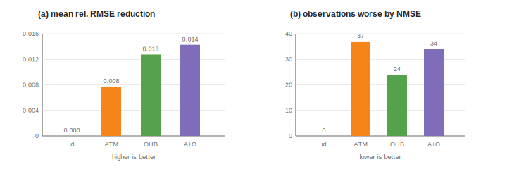
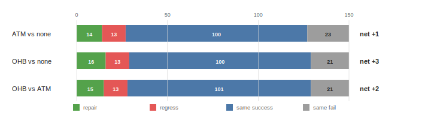
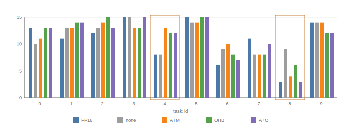
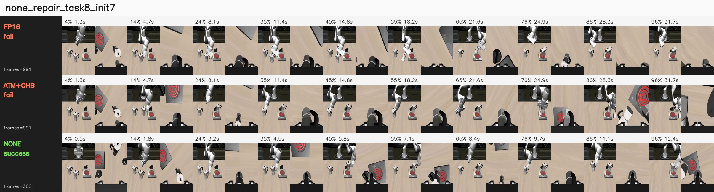
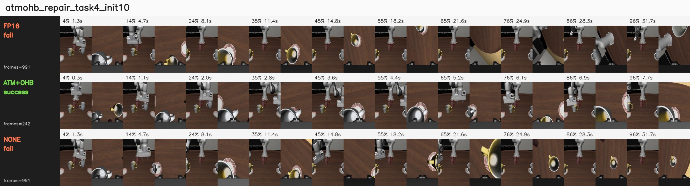
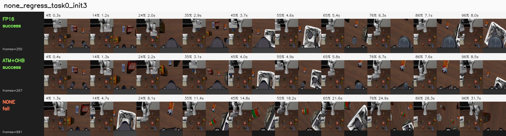
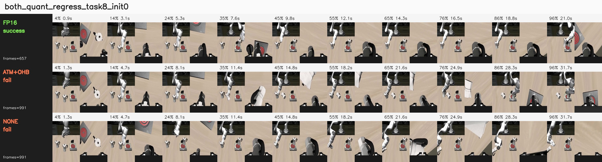

# When Small Action Errors Matter: Closed-Loop Analysis of Post-Training Quantization for VLA Policies

Working draft.

patrick.zhang  
patrick.zhang5233@gmail.com

## Abstract

Post-training quantization (PTQ) is usually presented as a compression procedure: a full-precision model is mapped into a low-precision representation, and the resulting model is evaluated by output drift, task accuracy, or deployment efficiency. For vision-language-action (VLA) policies, this framing is incomplete. A VLA model is not only a predictor; it is a closed-loop controller. We argue that PTQ for VLA policies should be evaluated as a closed-loop policy perturbation. Quantization changes the implemented policy function, which can change the state distribution induced by robot-environment interaction. Small action errors can therefore be amplified by contact dynamics, receding-horizon feedback, and thresholded success conditions.

We study this effect in a reproduction-oriented analysis of selective W4A8 fake quantization for a GR00T N1.5 policy on LIBERO-10. Offline teacher-student action drift shows that attention balancing methods can improve mean action error, but also worsen a non-trivial subset of held-out observations. In closed-loop simulation over 150 matched task-initialization pairs, selective W4A8 variants remain in the FP16 behavioral range under our evaluation protocol, but their gains are not monotonic: compensation methods repair some failed rollouts while introducing new failures elsewhere. The highest point-estimate single compensation mode, output head balancing (OHB), reaches 116/150 successes compared with 113/150 for uncompensated W4A8 and 108/150 for FP16, yet it still regresses several task slices. We do not claim statistically significant closed-loop superiority from these small aggregate gaps. Our study focuses on behavior under fake quantization rather than packed-kernel deployment efficiency. The results suggest that VLA quantization should be evaluated as policy perturbation, not merely as numerical approximation.

## 1. Introduction

Large vision-language-action models are increasingly used as generalist robot policies. They map visual observations and language instructions into action chunks, often through diffusion-style denoising or transformer action heads. As these models become larger, quantization is a natural route toward cheaper deployment. However, common quantization evaluations focus on local approximation quality: weight error, activation error, output MSE, or single-step action drift. These metrics are useful, but they do not fully capture what matters for embodied control.

In a closed-loop policy, an action error at time `t` changes the next observation. The next action is then produced on a state that may not have been visited by the original full-precision policy. This feedback loop creates a mismatch between local teacher-student error and final task success. The issue is especially sharp in manipulation, where small geometric deviations can change contact timing, grasp stability, object pose, or whether a state satisfies a binary success predicate.

This paper studies the following question:

> When a VLA policy is post-training quantized, how should we interpret small action errors in terms of closed-loop task success?

Our answer is that PTQ should be treated as a policy perturbation. It maps a full-precision policy into a constrained low-precision function class, thereby changing both the conditional action distribution and the induced state distribution. The relevant empirical object is not only local action drift on fixed observations, but also how the perturbed policy redistributes success and failure across matched closed-loop rollouts.

We make three observations:

1. Selective W4A8 quantization can be behaviorally robust even when it measurably changes action outputs.
2. Attention-balancing corrections can improve mean offline drift while still worsening individual observations and task slices.
3. Paired closed-loop rollout flips expose repair/regression structure that aggregate success rates hide.

Our contributions are:

1. We formulate PTQ for VLA policies as a closed-loop policy perturbation problem, where the main object is the induced state distribution rather than only local action approximation.
2. We derive local perturbation claims showing that quantization error matters through sensitivity-weighted propagation and terminal success-margin crossing, and formulate a closed-loop quantization criterion for future correction methods.
3. We provide a reproduction-oriented GR00T/LIBERO case study showing that selective W4A8 fake quantization can remain in the FP16 behavioral range while changing which task-initialization pairs succeed.
4. We show that offline mean drift and aggregate success rate can both obscure important structure, and advocate paired repair/regression analysis as a compact diagnostic for VLA quantization.

### From Point Solution to Design-Space Map

Our goal is not to present a single operating point in the VLA quantization design space. Instead, we use this operating point to expose structure in the problem: which perturbations are absorbed, which are amplified by closed-loop dynamics, which rollouts are repaired or regressed, and which modules or states should be protected by future methods.

These properties are useful beyond our specific implementation. They suggest how later work might choose calibration states, design residual action corrections, select mixed-precision modules, or trigger high-precision fallback around fragile trajectory regions.

### Scope of Claims

This paper should be read as a behavior-level reproduction study and diagnostic analysis, not as a new quantization algorithm or a deployment benchmark. We make no latency, memory, or energy claim because our implementation uses fake quantization rather than packed low-precision kernels. We also do not treat small aggregate success-rate differences as evidence of policy dominance. The main empirical claim is narrower: VLA quantization can preserve aggregate success while redistributing which closed-loop rollouts succeed, so paired rollout analysis is necessary to interpret the effect of small action perturbations.

The resulting design principle is:

> VLA quantization should target sensitivity-weighted closed-loop perturbation rather than only average open-loop action error.

## 2. Related Work

### Vision-Language-Action Policies

Recent robot policies increasingly combine large-scale visual, language, and action modeling. RT-1 introduced a scalable transformer policy trained on diverse real-robot data, while RT-2 framed robotic actions as tokens inside a vision-language-action model and showed transfer from web-scale vision-language training to control [RT-1; RT-2]. OpenVLA made this direction more accessible by releasing a 7B-parameter open-source VLA trained on large robot demonstration mixtures, and also noted practical interest in efficient fine-tuning and quantized serving [OpenVLA]. Diffusion Policy and related action-diffusion methods model robot behavior as conditional denoising, often with receding-horizon control, which makes local output perturbations especially relevant to closed-loop behavior [Diffusion Policy]. Our work focuses on the evaluation problem that appears when such policies are compressed after training.

### Post-Training Quantization

PTQ methods for large transformers often target memory and latency while preserving model quality. LLM.int8() handles transformer outliers through mixed-precision decomposition [LLM.int8]; GPTQ uses approximate second-order information for one-shot low-bit weight quantization [GPTQ]; SmoothQuant migrates quantization difficulty from activations to weights through an equivalent smoothing transform [SmoothQuant]; and AWQ uses activation statistics to protect salient weight channels [AWQ]. These methods demonstrate that transformer quantization can be accurate when calibration accounts for activation structure. However, most evaluations are open-loop language, vision-language, or recognition tasks. In VLA policies, the quantized model selects actions that alter future inputs, so the calibration and evaluation target must include closed-loop effects.

### Quantization For VLA Models

QuantVLA is, to our knowledge, the most direct prior work on PTQ for VLA systems. It proposes a scale-calibrated PTQ framework with selective quantization, attention temperature matching, and output head balancing, and reports memory and latency gains together with LIBERO success-rate improvements [QuantVLA]. Our study is not a deployment-efficiency reproduction of those claims. Instead, we use a behavior-level fake-quantization reproduction to analyze why VLA quantization can improve some rollouts while regressing others, and why paired closed-loop evaluation is necessary even when average offline drift improves.

### Sequential Prediction And Distribution Shift

The gap between offline error and closed-loop behavior is a classic issue in imitation learning and sequential prediction. DAgger formalizes the problem that future observations depend on previous actions, so policies trained or evaluated only under a fixed data distribution can suffer from compounding errors [DAgger]. VLA quantization creates a related but distinct problem: the policy is already trained, but PTQ perturbs its action outputs and therefore perturbs the state distribution it induces. This makes paired rollout analysis a natural complement to offline teacher-student action drift.

### Feedback Control Perspective

Classical feedback control emphasizes that closed-loop behavior is determined by the interaction between controller perturbations, plant dynamics, and feedback gain [Astrom and Murray]. We use this lens to interpret PTQ not as a static approximation problem, but as a bounded policy perturbation whose effect depends on local closed-loop sensitivity and task margins.

## 3. Quantization As Policy Perturbation

Let `pi_theta(a | s, l)` denote a full-precision VLA policy conditioned on state observation `s` and language instruction `l`. PTQ constructs a quantized policy:

```text
theta_q = Q(theta; C)
pi_q = pi_{theta_q}
```

where `Q` is a calibration-dependent projection into a low-precision parameterization and `C` is a calibration set. Even without gradient updates, this is not a neutral storage transform. It changes the implemented function.

Offline action drift measures a local difference such as:

```text
e(s) = || pi_q(s, l) - pi_theta(s, l) ||
```

on observations sampled from some dataset or teacher rollout distribution. Closed-loop performance depends on the state distributions induced by the two policies:

```text
d_{pi_theta}(s)  vs.  d_{pi_q}(s)
```

The difference is recursive. For a local transition model:

```text
s_{t+1} = f(s_t, a_t)
a_t     = pi(s_t)
```

a first-order error expansion gives:

```text
delta s_{t+1}
  approximately J_s delta s_t + J_a delta a_t
```

where `delta a_t = pi_q(s_t) - pi_theta(s_t)`. Even if `delta a_t` is small on the teacher state distribution, the accumulated `delta s_t` can move the quantized policy into states where the original local error estimate no longer applies.

This is why manipulation success is not a smooth function of single-step action MSE. A rollout can flip because of a small action perturbation if that perturbation changes:

- whether the gripper reaches the object before closing,
- whether a placed object crosses a success-region boundary,
- whether an object contact produces a different pose,
- whether a receding-horizon action chunk enters a different trajectory basin.

In this view, quantization is closer to post-training policy editing than to passive compression.

Figure 1 in the LaTeX/PDF version illustrates the central evaluation mismatch with a native TikZ diagram. Offline action drift compares two actions on the same observation, while closed-loop execution lets each policy induce its own future observation distribution.

### Claim 1: Quantization Error Is Filtered By Closed-Loop Sensitivity

Let:

```text
eta_t = pi_q(s_t, l) - pi_theta(s_t, l)
```

be the local quantization-induced action perturbation on the nominal FP16 trajectory. Let:

```text
A_t = partial f / partial s
B_t = partial f / partial a
K_t = partial pi_theta / partial s
F_t = A_t + B_t K_t
```

with all derivatives evaluated along that nominal trajectory.

This is a local first-order claim, not a global guarantee. It assumes small perturbations around the FP16 trajectory, defines `eta_t` on that nominal trajectory, and approximates the quantized policy's local state Jacobian by the FP16 policy Jacobian. In other words, it ignores differences between `partial pi_q / partial s` and `partial pi_theta / partial s` at this order.

Under these assumptions, the terminal state perturbation is:

```text
delta s_T
  approximately sum_t
    (F_{T-1} F_{T-2} ... F_{t+1}) B_t eta_t
```

with the empty product interpreted as the identity.

Thus the effect of quantization is not determined by `||eta_t||` alone. It depends on how the error direction aligns with transition dynamics, policy feedback, and future closed-loop gain.

### Claim 2: Rollout Flips Are Margin-Crossing Events

Let `h(s_T)` be an implicit terminal success margin:

```text
success iff h(s_T) > 0
```

For a small terminal perturbation:

```text
h(s_T^q) - h(s_T)
  approximately grad h(s_T)^T delta s_T
```

A rollout can flip when:

```text
|grad h(s_T)^T delta s_T| >= approximately |h(s_T)|
```

More precisely, the outcome flips when the perturbation changes the sign of the margin:

```text
sign(h(s_T^q)) != sign(h(s_T))
```

The two directions have different signs. If the FP16 rollout succeeds:

```text
h(s_T) > 0
```

then a quantized regression requires:

```text
grad h(s_T)^T delta s_T <= approximately -h(s_T)
```

If the FP16 rollout fails:

```text
h(s_T) < 0
```

then a quantized repair requires:

```text
grad h(s_T)^T delta s_T >= approximately |h(s_T)|
```

So the absolute-value condition is a magnitude condition for either flip direction. The sign determines whether the perturbation causes a repair or a regression.

This explains why two rollouts with similar single-step action drift can behave differently. High-margin trajectories absorb the perturbation, while low-margin trajectories near contact or placement boundaries can cross the success threshold.

### Design Principle: Optimize Sensitivity-Weighted Closed-Loop Perturbation

The propagation and margin-crossing equations suggest that the relevant PTQ objective for VLA policies is not average open-loop action deviation:

$$
\min_Q \mathbb{E}\sum_t \|\eta_t(Q)\|^2
$$

Instead, the target should be a sensitivity-weighted perturbation objective:

$$
\min_Q \mathbb{E}\sum_t \eta_t(Q)^\top G_t \eta_t(Q)
$$

One local terminal-margin approximation is:

$$
G_t =
B_t^\top \Phi_{t\to T}^\top
\nabla h(s_T)\nabla h(s_T)^\top
\Phi_{t\to T} B_t
$$

with:

$$
\Phi_{t\to T}=F_{T-1}\cdots F_{t+1}
$$

This objective is a separable local surrogate, not the exact squared full-horizon terminal-margin objective. To see this, define:

```text
alpha_t = grad h(s_T)^T Phi_{t->T} B_t eta_t
        = c_t^T eta_t
```

where:

```text
c_t = B_t^T Phi_{t->T}^T grad h(s_T)
```

The first-order terminal margin perturbation is:

```text
Delta h approximately sum_t alpha_t
```

The exact squared approximation expands as:

```text
(Delta h)^2
  approximately (sum_t alpha_t)^2
  = sum_t alpha_t^2 + 2 sum_{i<j} alpha_i alpha_j
```

The per-step term is:

```text
sum_t alpha_t^2
  = sum_t eta_t^T c_t c_t^T eta_t
  = sum_t eta_t^T G_t eta_t
```

This is the objective above. The omitted cross-time terms:

```text
2 sum_{i<j} alpha_i alpha_j
```

represent interactions between quantization errors at different rollout steps. They can amplify risk when their margin effects have the same sign, or partially cancel when their effects have opposite signs.

We therefore use the separable objective as a tractable proxy. It is most reasonable when cross-time quantization errors are weakly correlated, or when the goal is to rank locally sensitive perturbation directions rather than exactly optimize rollout-level margin loss.

In practice, $G_t$ is difficult to estimate exactly. But the expression identifies the target: reduce quantization error in state-action directions that are amplified by feedback dynamics and projected onto small task margins. Layer-statistic corrections such as ATM and OHB can be useful proxies, but they do not by themselves optimize this closed-loop criterion.

### Claim 3: Offline Drift Is Incomplete Without State-Distribution Control

Let `loss(s)` denote a closed-loop-relevant loss, such as action drift, sensitivity-weighted action error, or risk of approaching a failure boundary. Offline validation estimates behavior under a fixed distribution, usually a dataset distribution or the FP16-induced distribution. Closed-loop quantized execution samples from a different distribution:

```text
E_{s ~ d_piq}[loss(s)]
  =
  E_{s ~ d_pi}[loss(s)]
  +
  (E_{s ~ d_piq}[loss(s)] - E_{s ~ d_pi}[loss(s)])
```

Open-loop action drift controls only the fixed-distribution term. It does not by itself control the distribution-shift term induced by executing the perturbed policy.

This matters because a small nominal action error can move the system away from the FP16 trajectory. After that, the quantized policy may visit states with larger quantization error, higher closed-loop sensitivity, or smaller task margins.

If `loss` is nonnegative and bounded, the distribution-shift term can be bounded by total variation distance:

```text
|E_{d_piq}[loss] - E_{d_pi}[loss]|
  <= 2 ||loss||_infinity TV(d_piq, d_pi)
```

where `TV(p, q) = 1/2 ||p - q||_1`. If `loss` is Lipschitz under a state metric, an analogous Wasserstein bound is:

```text
|E_{d_piq}[loss] - E_{d_pi}[loss]|
  <= L W_1(d_piq, d_pi)
```

The point is not that these distances are easy to estimate in high-dimensional robot rollouts. The point is that fixed-distribution drift is only one term. Predicting rollout robustness also requires controlling how far the quantized policy moves the visited state distribution.

### Claim 4: Aggregate Success Differences Decompose Exactly Into Repairs And Regressions

For matched cases `c` and binary success indicators `S_A(c), S_B(c)`:

```text
sum_c S_B(c) - sum_c S_A(c)
  =
  count(A fail, B success)
  -
  count(A success, B fail)
```

This identity is simple but important: a net success gain can hide substantial behavioral churn. Paired repairs and regressions are therefore not an optional diagnostic; they are the decomposition of the aggregate number.

## 4. Experimental Setup

### Model And Task

We use the GR00T N1.5 LIBERO long-horizon checkpoint and evaluate on LIBERO-10. The accepted FP16 baseline matches the official reference result of 38/50 on the standard 5-trial LIBERO-10 run.

The evaluated policy predicts action chunks with seven action components:

```text
x, y, z, roll, pitch, yaw, gripper
```

Unless noted otherwise, experiments use 8 denoising steps.

### Quantization Scope

We study the selective `llm_dit_mlp` W4A8 fake-quantization scope:

| group | modules |
|---|---:|
| selected LLM linear layers | 84 |
| selected DiT MLP linear layers | 32 |
| total quantized modules | 116 |

DiT attention projections are intentionally left in floating point. This design matters: attention projections feed a softmax routing mechanism, while MLP errors are more often residual perturbations. The selective scope therefore tests a method-level idea rather than naive whole-model quantization.

### Compensation Modes

Following QuantVLA terminology, we evaluate two scale-calibrated compensation mechanisms: attention temperature matching (ATM) and output head balancing (OHB). Our implementation should be read as a reproduction-oriented approximation of these mechanisms rather than a claim of exact code-level equivalence to the original implementation.

ATM rescales the DiT attention query to match teacher/student attention-logit standard deviation:

```text
alpha = std_teacher(attention_logits) / std_student(attention_logits)
query <- alpha * query
```

OHB rescales the attention output before residual addition to match teacher/student attention-output RMS:

```text
beta = rms_teacher(attention_output) / rms_student(attention_output)
attention_output <- beta * attention_output
```

The combined mode applies both corrections. In all cases the compensation acts on DiT attention processors; it does not mean DiT attention weights are quantized.

### Offline Drift Protocol

The offline validation uses real LIBERO observations:

| item | value |
|---|---:|
| calibration observations | 16 |
| held-out evaluation observations | 128 |
| quantized modules | 116 |
| activation scale | dynamic absmax |
| denoising steps | 8 |

Teacher and student calls use matched random seeds because action denoising begins from random Gaussian actions. We report NMSE, relative RMSE, cosine similarity, and max absolute difference.

### Closed-Loop Protocol

The main closed-loop analysis evaluates LIBERO-10 initial states `0..14`:

| item | value |
|---|---:|
| tasks | 10 |
| initial states per task | 15 |
| episodes per policy/mode | 150 |
| simulator | LIBERO headless EGL |
| hardware | RTX 5090 |

For paired comparisons, each mode is evaluated on the same task-initialization pairs. This enables us to count repaired failures and new regressions directly.

We report Wilson 95% confidence intervals for aggregate success rates as a descriptive uncertainty estimate, but use paired repair/regression counts as the primary behavioral diagnostic.

## 5. Results

### 5.1 Offline Mean Drift Improves, But Individual Regressions Remain

On the 128 held-out real observations, ATM and OHB reduce mean action drift relative to uncompensated W4A8.

| config | mode | modules | NMSE mean | rel RMSE mean | cosine mean | max abs diff |
|---|---|---:|---:|---:|---:|---:|
| `llm_dit_mlp` | none | 116 | 0.0178962 | 0.0981458 | 0.992492 | 0.989746 |
| `llm_dit_mlp` | identity | 116 | 0.0178962 | 0.0981458 | 0.992492 | 0.989746 |
| `llm_dit_mlp` | ATM | 116 | 0.0159471 | 0.0904183 | 0.993101 | 0.987793 |
| `llm_dit_mlp` | OHB | 116 | 0.0160919 | 0.0853958 | 0.992769 | 0.990967 |
| `llm_dit_mlp` | ATM+OHB | 116 | 0.0153168 | 0.0838784 | 0.993048 | 0.987061 |

The identity control exactly matches `none`, showing that the custom attention processor path itself does not introduce measurable drift. However, the mean improvement hides observation-level regressions.

| mode | observations worse than `none` by NMSE | mean delta NMSE | mean delta rel RMSE |
|---|---:|---:|---:|
| identity | 0/128 | 0 | 0 |
| ATM | 37/128 | -0.00194913 | -0.00772748 |
| OHB | 24/128 | -0.00180429 | -0.01275 |
| ATM+OHB | 34/128 | -0.00257947 | -0.0142674 |

Negative deltas mean improvement over `none`. Thus ATM+OHB has the best mean drift, while still worsening 34 of 128 held-out observations.

This is the first sign that mean offline drift is insufficient. The compensation moves the action distribution closer on average, but not uniformly.



Figure 2 summarizes this non-monotonicity visually: the same compensation mode can improve mean relative RMSE while making a subset of held-out observations worse by NMSE.

### 5.2 Selective W4A8 Remains in the FP16 Range

Over 150 LIBERO-10 task-initialization pairs, selective W4A8 remains in the same performance band as FP16. Some quantized variants have higher aggregate point estimates, but these gaps should not be read as evidence that quantization is inherently better than FP16.

| policy | successes | success rate (Wilson 95% CI) |
|---|---:|---:|
| FP16 | 108/150 | 72.0% [64.3, 78.6] |
| W4A8 `llm_dit_mlp` + none | 113/150 | 75.3% [67.9, 81.5] |
| W4A8 `llm_dit_mlp` + ATM | 114/150 | 76.0% [68.6, 82.1] |
| W4A8 `llm_dit_mlp` + OHB | 116/150 | 77.3% [70.0, 83.3] |
| W4A8 `llm_dit_mlp` + ATM+OHB | 114/150 | 76.0% [68.6, 82.1] |

The confidence intervals are wide and overlapping, so the table should not be read as a statistical ranking of policies. The more stable conclusion is that selective W4A8 remains in the same behavioral range as FP16 under this protocol, while changing the identity of successful and failed rollouts.

Rather, the quantized policies perturb the trajectory distribution. In finite closed-loop evaluation, that perturbation can push some failed FP16 trajectories into successful basins while pushing other successful trajectories into failure.

### 5.3 Aggregate Rates Hide Task-Level Redistribution

The following table shows that the effects are task-dependent.

| task id | FP16 | none | ATM | OHB | ATM+OHB |
|---:|---:|---:|---:|---:|---:|
| 0 | 13/15 | 10/15 | 11/15 | 13/15 | 13/15 |
| 1 | 11/15 | 13/15 | 13/15 | 14/15 | 14/15 |
| 2 | 12/15 | 13/15 | 14/15 | 15/15 | 13/15 |
| 3 | 15/15 | 15/15 | 13/15 | 13/15 | 15/15 |
| 4 | 8/15 | 8/15 | 13/15 | 12/15 | 12/15 |
| 5 | 15/15 | 14/15 | 14/15 | 15/15 | 15/15 |
| 6 | 6/15 | 9/15 | 10/15 | 8/15 | 7/15 |
| 7 | 11/15 | 8/15 | 8/15 | 8/15 | 10/15 |
| 8 | 3/15 | 9/15 | 4/15 | 6/15 | 3/15 |
| 9 | 14/15 | 14/15 | 14/15 | 12/15 | 12/15 |

ATM improves task 4 by 5 successes over `none`, but regresses task 8 by 5 successes. OHB is more balanced and gives the highest aggregate point estimate, but it still regresses tasks 3, 8, and 9 relative to `none`.

### 5.4 Paired Rollout Flips Reveal The Mechanism

Paired comparisons over identical task-initialization pairs show that the compensation modes are not monotonic improvements.

| comparison | repaired failures | new regressions | same success | same failure | net |
|---|---:|---:|---:|---:|---:|
| ATM vs none | 14 | 13 | 100 | 23 | +1 |
| OHB vs none | 16 | 13 | 100 | 21 | +3 |
| OHB vs ATM | 15 | 13 | 101 | 21 | +2 |

This table is more informative than the aggregate success rates. For example, OHB is not simply "3 episodes better" than `none`; it repairs 16 failures and introduces 13 new failures. Its net gain is small, but the underlying trajectory redistribution is substantial.

For the disjoint init `5..14` comparison between FP16 and ATM+OHB W4A8, we observe the same pattern:

| transition | count |
|---|---:|
| FP16 success, quant success | 62 |
| FP16 failure, quant failure | 16 |
| FP16 failure, quant success | 14 |
| FP16 success, quant failure | 8 |

The aggregate gain of 6/100 comes from 14 repaired FP16 failures minus 8 new quantized failures.



Figure 3 is the main behavioral diagnostic. It separates net success-rate changes into repaired failures, new regressions, unchanged successes, and unchanged failures.

### 5.5 Keyframe-Based Trajectory Diagnostics

To make the paired flips more concrete, we inspected contact sheets for representative repaired and regressed rollouts. Each contact sheet contains three matched policy rows: FP16, W4A8 `none`, and W4A8 ATM+OHB. The frames are sampled uniformly over the rollout. The sheets are included in the repository under `analysis_keyframes/`; they are diagnostic artifacts rather than a new quantitative benchmark.

| case | outcome pattern | keyframe-level observation | interpretation |
|---|---|---|---|
| task 8 init 7 | FP16 fail 991; ATM+OHB fail 991; `none` success 388 | `none` enters a short successful approach branch early, while FP16 and ATM+OHB spend the late rollout in repeated correction. | Raw quantization can push a weak FP16 task slice out of a failure basin. |
| task 4 init 10 | FP16 fail 991; `none` fail 991; ATM+OHB success 242 | ATM+OHB completes the mug/plate interaction quickly; the other rows remain in horizon-length correction. | Compensation can repair a task by changing contact timing or object-interaction order. |
| task 0 init 3 | FP16 success 250; ATM+OHB success 267; `none` fail 991 | `none` disturbs an otherwise fast object-container relation and never recovers. | The same raw perturbation that repairs some cases can regress high-margin FP16 successes. |
| task 6 init 1 | FP16 success 222; `none` success 477; ATM+OHB fail 991 | ATM+OHB remains visually stable but under-progresses around the decisive placement phase. | Balancing can be too conservative or shift progress timing, even when it reduces mean offline drift. |
| task 8 init 0 | FP16 success 657; ATM+OHB fail 991; `none` fail 991 | Both quantized rows take the wrong side of a task-8 decision boundary that FP16 crosses successfully. | Task-level gains are not monotonic; the same task can contain repairs and regressions. |

These examples support the trajectory-redistribution interpretation. The repaired cases do not look like small final-frame placement corrections; they usually branch earlier and terminate much sooner than the corresponding failures. The regressed cases show the complementary failure: a small policy perturbation can disrupt an early object relation or produce a stable but insufficiently progressive path. Thus the paired counts in the previous table correspond to visible differences in trajectory basins, not only bookkeeping changes in aggregate success.

### 5.6 Empirical Support For The Theoretical Claims

The theoretical claims in Section 3 are not used as proof that one quantized policy is superior. They organize what must be measured. The experiments support the claims in the following sense.

| claim | experimental evidence | interpretation |
|---|---|---|
| Sensitivity-weighted perturbation | Small action changes produce both repairs and regressions under the same model family. Keyframe repairs branch early rather than only correcting final placement. | The effect depends on where the perturbation enters the trajectory, not only on its norm. |
| Margin crossing | Task 8 contains both directions: W4A8 `none` improves task 8 from 3/15 FP16 successes to 9/15, yet task 8 init 0 is a case where both quantized modes regress a successful FP16 rollout. | The same task can contain low-margin failures that are repaired and low-margin successes that are broken. |
| Offline drift insufficiency | ATM+OHB has the best mean offline drift, but OHB has the highest aggregate closed-loop point estimate; ATM improves task 4 by 5 successes over `none` while regressing task 8 by 5. | Reducing average open-loop error does not imply monotonic closed-loop improvement. |
| Repair/regression decomposition | OHB vs `none` has 16 repaired failures and 13 new regressions, yielding only a net +3 successes. ATM vs `none` is 14 repairs and 13 regressions. | Aggregate success changes hide substantial redistribution of which rollouts succeed. |

## 6. Analysis

### 6.1 Why Can A Quantized Policy Improve A Rollout?

The quantized policy is not guaranteed to be worse than FP16 in a finite simulator benchmark. FP16 is not an oracle; it is a learned policy with its own fragile regions. A small action perturbation can move a trajectory away from a failure mode. This is especially plausible when the FP16 policy is already weak on a task slice, such as LIBERO task 8 in our baseline.

Therefore, an aggregate improvement should not be read as "low precision is better." It means the perturbed policy enters different trajectory basins, some of which are more favorable under the benchmark's finite initial states and success predicates.

### 6.2 Why Does Offline Drift Fail To Predict Closed-Loop Behavior?

Offline drift is measured on a fixed observation set. Closed-loop rollouts produce observations adaptively. Once a quantized action changes the environment state, later observations may differ from the offline distribution. This creates two mismatches:

1. The local action error estimate may not apply to the new states.
2. The success function may be discontinuous around contact and placement boundaries.

This explains why ATM+OHB can have the best mean offline NMSE but not the best closed-loop aggregate success. It also explains why a mode can improve mean drift while still causing rollouts to regress.

### 6.3 A Control-Theoretic Interpretation

From a feedback-control perspective, quantization acts like a structured input disturbance injected into the learned controller:

```text
a_t^q = pi_theta(s_t^q, l) + eta(s_t^q, l)
```

where `eta` is the action perturbation induced by quantization and compensation. Linearizing around an FP16 trajectory gives:

```text
delta s_{t+1}
  approximately (A_t + B_t K_t) delta s_t + B_t eta_t
```

where `A_t = partial f / partial s`, `B_t = partial f / partial a`, and `K_t = partial pi_theta / partial s` along the trajectory. The closed-loop sensitivity is therefore governed not only by the magnitude of `eta_t`, but also by the local closed-loop gain induced by the environment dynamics and the policy feedback. A small action perturbation can be attenuated in low-gain regions and amplified near contact, grasping, or placement transitions.

This also makes success a margin problem. Let `h(s_T)` denote an implicit terminal success margin, with success when `h(s_T) > 0`. A rollout with large positive margin can tolerate sizeable action perturbations, while a low-margin rollout can flip if quantization moves `h(s_T)` across zero. This explains why paired outcomes contain both repairs and regressions: quantization can move a trajectory away from one failure basin while pushing another trajectory across a success boundary. The useful diagnostic is therefore not just average action error, but the alignment between action perturbations, closed-loop sensitivity, and task success margins.

### 6.4 Why Is Selective W4A8 Robust?

The `llm_dit_mlp` scope leaves DiT attention projections in floating point. This avoids quantizing the most routing-sensitive part of the action head. A perturbation to `QK^T` before softmax can change attention entropy and token routing:

```text
softmax(QK^T / sqrt(d))
```

By contrast, MLP quantization more often enters as an additive residual perturbation:

```text
y_student = y_teacher + epsilon
```

Layer normalization, residual connections, diffusion denoising, and receding-horizon replanning can absorb some of this error. This helps explain why uncompensated W4A8 already reaches 113/150 successes.

### 6.5 Why Are ATM And OHB Not Additive?

ATM changes where attention looks by changing the attention-logit scale. OHB changes how strongly the attention output enters the residual stream. These operations are coupled:

```text
ATM changes attention probabilities.
OHB rescales the output produced by those probabilities.
```

If ATM moves routing into a different pattern, OHB rescales a different output than the one calibrated under the uncompensated student. The combined correction can overcorrect, undercorrect, or move the policy into a different trajectory basin. This is consistent with ATM+OHB reaching 114/150, below standalone OHB at 116/150.

### 6.6 What Should Be Reported For VLA Quantization?

The minimum evidence package should include:

- offline action drift on held-out real observations,
- per-component action error, not only whole-action MSE,
- closed-loop success on matched task-initialization pairs,
- per-task and per-init success rates,
- paired repair/regression counts,
- explicit distinction between fake-quant behavior and packed-kernel deployment.

Aggregate success is still useful, but it should not be the only behavioral result.

## 7. Implications

### For Evaluation

VLA quantization should be evaluated as a closed-loop policy perturbation. Reporting only MSE or only aggregate success can be misleading. Paired rollout flips are a compact way to expose whether a method is a monotonic improvement or a redistribution of successes.

### For Calibration

Calibration should not only minimize average layerwise or action-level error. It should consider which errors matter for downstream control. A useful calibration set should cover fragile contact states, low-margin success boundaries, and task slices where the FP16 policy is already weak.

A control-aware calibration objective would approximate the closed-loop criterion above: weight errors by estimated closed-loop sensitivity, not only by their open-loop magnitude. This points toward rollout-informed calibration sets, residual action correction, or risk-gated precision fallback as natural next steps beyond ATM/OHB-style statistic matching.

### Closed-Loop Credit Assignment

This perspective borrows an idea from reinforcement learning without requiring full policy optimization: local action errors should be assigned credit according to their downstream effect on future rollout outcomes.

In standard PTQ, an error `eta_t` is usually priced by its immediate norm. In the closed-loop view, its risk is closer to:

```text
risk(eta_t) approximately eta_t^T G_t eta_t
```

which assigns larger cost to directions that propagate through dynamics and reduce terminal task margin.

This suggests a lightweight alternative to direct RL: use paired rollouts, first-divergence states, or low-margin states to estimate sensitivity proxies, then guide calibration, mixed precision, residual correction, or fallback decisions.

Future experiments can test whether this RL-style credit assignment improves repair/regression balance without the instability and sample cost of optimizing the full VLA policy by reinforcement learning.

### For Quantized Acceleration

For VLA or world-model deployment, layer selection should not be based only on parameter count or FLOPs. A useful low-precision candidate should have both high compute benefit and low closed-loop sensitivity.

Informally, for a module `i` with expected speed benefit `g_i` and quantization-induced perturbation `eta_i`, the relevant risk is closer to:

```text
r_i approximately E[eta_i^T G_i eta_i]
```

where `G_i` summarizes downstream dynamics, feedback, and task-margin sensitivity. This suggests a mixed-precision selection rule:

```text
prioritize modules with large g_i / r_i
```

and leave routing-sensitive, contact-critical, or margin-critical components in higher precision unless closed-loop tests show otherwise.

### For Fine-Tuning

Quantization-aware fine-tuning should be understood as policy adaptation under low-precision constraints. If the objective is only behavior cloning on static observations, it may still miss closed-loop state distribution shift. More policy-aware objectives may be needed, such as rollout-informed calibration, DAgger-style data aggregation, or task-slice reweighting.

### For Deployment Claims

Our results are behavior-level evidence for fake W4A8 quantization. They do not establish latency, memory, or energy improvements. A complete deployment claim requires packed low-precision kernels and end-to-end inference profiling.

## 8. Limitations

This study has several limitations:

- The quantized implementation uses fake quantization, not a final packed int4/int8 deployment backend.
- Results are from one GR00T N1.5 checkpoint and LIBERO-10, not multiple VLA families.
- The main closed-loop benchmark has 150 task-initialization pairs; larger runs would provide tighter statistical confidence, and the current aggregate success intervals overlap.
- We do not run real-robot experiments.
- ATM/OHB are implemented as reproduction-oriented calibration mechanisms; exact implementation details may differ from the original paper.
- The keyframe diagnostics cover representative flips, but they are qualitative and not an exhaustive geometric measurement for every paired outcome.

These limitations do not weaken the central methodological point: local action approximation and closed-loop policy behavior are distinct evaluation targets.

## 9. Conclusion

Post-training quantization of VLA policies should be viewed as policy perturbation. Even small action errors can matter because they enter a feedback loop, alter the closed-loop state distribution, and interact with task-dependent success margins. In our GR00T/LIBERO reproduction, selective W4A8 quantization remains behaviorally robust and can shift aggregate point estimates, but those shifts come from task-dependent repair/regression redistribution rather than uniform dominance. Attention compensation methods reduce mean offline drift, yet their closed-loop effects are non-monotonic.

The main lesson is practical: VLA quantization papers should report paired closed-loop rollouts, not only offline drift or aggregate success. Small action errors matter when they change the trajectory basin.

## Appendix A. Detailed Experimental Tables

### A.1 Standard 5-Trial FP16 And ATM+OHB W4A8

| task id | FP16 | W4A8 ATM+OHB | delta |
|---:|---:|---:|---:|
| 0 | 5/5 | 5/5 | 0 |
| 1 | 3/5 | 4/5 | +1 |
| 2 | 3/5 | 5/5 | +2 |
| 3 | 5/5 | 5/5 | 0 |
| 4 | 4/5 | 4/5 | 0 |
| 5 | 5/5 | 5/5 | 0 |
| 6 | 3/5 | 2/5 | -1 |
| 7 | 4/5 | 3/5 | -1 |
| 8 | 1/5 | 0/5 | -1 |
| 9 | 5/5 | 5/5 | 0 |
| total | 38/50 | 38/50 | 0 |

### A.2 Disjoint Init 5..14 FP16 And ATM+OHB W4A8

| task id | FP16 | W4A8 ATM+OHB | delta |
|---:|---:|---:|---:|
| 0 | 8/10 | 8/10 | 0 |
| 1 | 8/10 | 10/10 | +2 |
| 2 | 9/10 | 8/10 | -1 |
| 3 | 10/10 | 10/10 | 0 |
| 4 | 4/10 | 8/10 | +4 |
| 5 | 10/10 | 10/10 | 0 |
| 6 | 3/10 | 5/10 | +2 |
| 7 | 7/10 | 7/10 | 0 |
| 8 | 2/10 | 3/10 | +1 |
| 9 | 9/10 | 7/10 | -2 |
| total | 70/100 | 76/100 | +6 |

### A.3 Ablation: W4A8 None, ATM, OHB

| task id | none | ATM | OHB | ATM - none | OHB - none |
|---:|---:|---:|---:|---:|---:|
| 0 | 10/15 | 11/15 | 13/15 | +1 | +3 |
| 1 | 13/15 | 13/15 | 14/15 | 0 | +1 |
| 2 | 13/15 | 14/15 | 15/15 | +1 | +2 |
| 3 | 15/15 | 13/15 | 13/15 | -2 | -2 |
| 4 | 8/15 | 13/15 | 12/15 | +5 | +4 |
| 5 | 14/15 | 14/15 | 15/15 | 0 | +1 |
| 6 | 9/15 | 10/15 | 8/15 | +1 | -1 |
| 7 | 8/15 | 8/15 | 8/15 | 0 | 0 |
| 8 | 9/15 | 4/15 | 6/15 | -5 | -3 |
| 9 | 14/15 | 14/15 | 12/15 | 0 | -2 |
| total | 113/150 | 114/150 | 116/150 | +1 | +3 |



Figure 4 provides the detailed task-wise view behind the aggregate closed-loop results.

## Appendix B. Enlarged Keyframe Contact Sheets

The following contact sheets support the qualitative diagnostics in Section 5.5. Each sheet shows matched FP16, W4A8 `none`, and W4A8 ATM+OHB rows sampled uniformly over the rollout.

### B.1 task 8 init 7: raw quant repair



### B.2 task 4 init 10: ATM+OHB repair



### B.3 task 0 init 3: raw quant regression



### B.4 task 6 init 1: ATM+OHB regression


### B.5 task 8 init 0: both quantized modes regress



## Appendix C. Figure Source Notes

Figure 1 is a native LaTeX/TikZ diagram in `paper/main.tex`, based on the policy-perturbation framing in Section 3.

Figure 2 uses the random 128 held-out offline validation and regression analysis from:

- `docs/phase4_real_data_validation_d8_cal16_eval128_random.md`
- `docs/phase4_real_data_validation_d8_cal16_eval128_random_regressions.md`

Figure 3 uses the paired ablation counts from `docs/phase5_llm_dit_mlp_ablation_init0_14.md`.

Figure 4 uses the combined per-task success table from Section 5.3 and Appendix A.

All SVGs are generated by `paper/generate_figures.py`.

## References

- [QuantVLA] Jingxuan Zhang et al. "QuantVLA: Scale-Calibrated Post-Training Quantization for Vision-Language-Action Models." arXiv:2602.20309, 2026. https://arxiv.org/abs/2602.20309
- [GR00T N1] NVIDIA et al. "GR00T N1: An Open Foundation Model for Generalist Humanoid Robots." arXiv:2503.14734, 2025. https://arxiv.org/abs/2503.14734
- [LIBERO] Bo Liu et al. "LIBERO: Benchmarking Knowledge Transfer for Lifelong Robot Learning." arXiv:2306.03310, 2023. https://arxiv.org/abs/2306.03310
- [RT-1] Anthony Brohan et al. "RT-1: Robotics Transformer for Real-World Control at Scale." arXiv:2212.06817, 2022. https://arxiv.org/abs/2212.06817
- [RT-2] Anthony Brohan et al. "RT-2: Vision-Language-Action Models Transfer Web Knowledge to Robotic Control." arXiv:2307.15818, 2023. https://arxiv.org/abs/2307.15818
- [OpenVLA] Moo Jin Kim et al. "OpenVLA: An Open-Source Vision-Language-Action Model." arXiv:2406.09246, 2024. https://arxiv.org/abs/2406.09246
- [Diffusion Policy] Cheng Chi et al. "Diffusion Policy: Visuomotor Policy Learning via Action Diffusion." arXiv:2303.04137, 2023. https://arxiv.org/abs/2303.04137
- [LLM.int8] Tim Dettmers et al. "LLM.int8(): 8-bit Matrix Multiplication for Transformers at Scale." arXiv:2208.07339, 2022. https://arxiv.org/abs/2208.07339
- [GPTQ] Elias Frantar et al. "GPTQ: Accurate Post-Training Quantization for Generative Pre-trained Transformers." arXiv:2210.17323, 2022. https://arxiv.org/abs/2210.17323
- [SmoothQuant] Guangxuan Xiao et al. "SmoothQuant: Accurate and Efficient Post-Training Quantization for Large Language Models." arXiv:2211.10438, 2022. https://arxiv.org/abs/2211.10438
- [AWQ] Ji Lin et al. "AWQ: Activation-aware Weight Quantization for LLM Compression and Acceleration." arXiv:2306.00978, 2023. https://arxiv.org/abs/2306.00978
- [DAgger] Stephane Ross, Geoffrey J. Gordon, and J. Andrew Bagnell. "A Reduction of Imitation Learning and Structured Prediction to No-Regret Online Learning." arXiv:1011.0686, 2010. https://arxiv.org/abs/1011.0686
